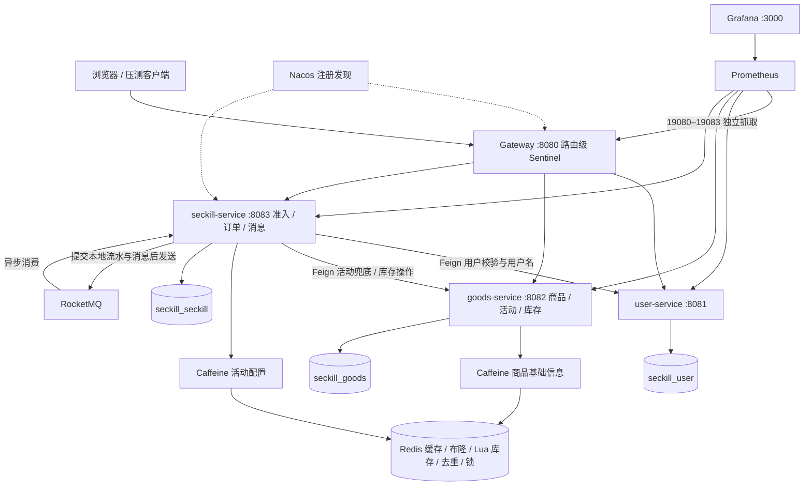

# 秒杀系统 · Seckill

面向秋招学习的 Java 高并发交易项目：从数据库条件扣库存演进到 Redis Lua 预扣、RocketMQ 异步落单，再拆为 Spring Cloud Alibaba 微服务，补充限流、热点缓存和监控。M0–M8 的计划交付已完成；这是一套可运行、可解释、可继续验证的工程实现，**不把学习环境的功能验证等同于真实生产上线认证**。

## 从哪里开始

| 你想做什么 | 入口 |
|---|---|
| 一条命令启动、停止、查状态 | [本机运行手册](docs/runbook.md) |
| 看架构、事务边界与完整下单过程 | [架构和链路](docs/architecture.md) |
| 核对压测数字、理解统计口径、自己复测 | [性能与证据](docs/performance.md) |
| 准备两分钟介绍、面试追问、简历描述 | [秋招讲解与简历](docs/interview.md) |
| 学 Micrometer / Prometheus / Grafana | [M7 监控实战](docs/M7-monitoring.md) |
| 看当前已知缺口和上线前验证项 | [边界与待办](docs/known-limitations.md) |
| 核对 M8 本轮做了什么、验证到哪里 | [M8 验收记录](docs/M8-validation.md) |

## 架构



三个业务库位于同一台本地 MySQL，但按服务划分表所有权；跨服务通过 Feign 调用，不跨库 join。Gateway 使用 WebFlux，不能引入传递 Servlet Web 依赖的 `seckill-common`。

| 模块 | 业务端口 / 管理端口 | 数据所有权 |
|---|---|---|
| seckill-common | 无 | 错误码、DTO、序列化、Redis key 等公共契约 |
| seckill-user | 8081 / 19081 | `t_user` |
| seckill-goods | 8082 / 19082 | `t_goods`、`t_stock`、`t_seckill_activity`、`t_stock_operation` |
| seckill-seckill | 8083 / 19083 | `t_order`、`t_seckill_record`、`t_local_message` |
| seckill-gateway | 8080 / 19080 | 无业务库，路由与入口保护 |

管理端口仅在 `monitoring` profile 启用。内部 `/internal/**` 不配置 Gateway 路由；直接服务端口在本地仍可访问，路由隔离不能替代认证。

## 一键启动（Windows）

前置：JDK 21 在 PATH、Docker Desktop 的 Linux engine 已运行、支持 `docker compose up --wait` 的 Compose、PowerShell 5.1 或 7。首次需下载 Maven 依赖和镜像；Node.js 18+ 仅在运行压测脚本时需要。

```powershell
git clone https://github.com/guagua222-22/seckill.git
cd seckill
powershell -NoProfile -ExecutionPolicy Bypass -File scripts/dev/start.ps1
```

脚本等待中间件健康、幂等建立三库、构建全部模块、按 user → goods → seckill → gateway 启动 JVM，最后启动现有监控组。Flyway 负责建表。默认不创建用户/商品/活动，不执行下单或清理数据。

- 验证台：[localhost:8080](http://localhost:8080/)
- 看板：[Grafana M7](http://localhost:3000/d/seckill-m7)（`admin`；首次生成的密码见本地 `.env.monitoring`）
- 抓取：[Prometheus Targets](http://localhost:9090/targets)；告警：[Alerts](http://localhost:9090/alerts)
- 注册中心：[Nacos](http://localhost:8848/nacos)

```powershell
# 已构建时跳过 Maven；观察已有活动的库存（替换为你的实际 ID）
powershell -File scripts/dev/start.ps1 -SkipBuild -ActivityIds "2099130660617097217"
# 不启动监控组件；新建 JVM 也不启用 monitoring profile
powershell -File scripts/dev/start.ps1 -WithoutMonitoring
# 只读状态检查
powershell -File scripts/dev/status.ps1
# 停止本脚本管理的 JVM；保留容器、数据卷和 IDEA 启动的进程
powershell -File scripts/dev/stop.ps1
```

已有本项目进程会复用，其代码与参数不会自动更新；重新构建不代表运行中的 JVM 已升级。端口被其他程序占用时会报错，不会杀进程抢端口。完整参数、IDEA/手动启动、故障恢复见 [运行手册](docs/runbook.md)。

## 一次请求做了什么

1. Gateway 路由级限流；秒杀服务做总 QPS 和热点活动参数限流。
2. 检查 requestId 流水，读取 Caffeine / Redis 活动配置，校验时间窗，通过 Feign 校验用户并取得用户名快照。
3. Lua 原子判断未预热、重复资格、库存不足，成功时扣 Redis 库存并登记用户。
4. `RecordMessageWriter` 在**同一个本地事务**写秒杀流水和本地消息；事务提交后异步发送 MQ，接口返回 code=0。
5. 消费端使用 SETNX、Redisson 锁和数据库唯一键降低重复处理，通过 goods 服务扣 DB 库存，在秒杀库插订单、推进流水。
6. 发消息失败由补偿任务重发；异常路径有库存回滚、重试、对账。各机制的覆盖范围和剩余窗口见 [架构说明](docs/architecture.md) 与 [已知边界](docs/known-limitations.md)。

**code=0 通常表示入口排队成功，不是异步订单最终成功。** 通过 `GET /api/order/query?requestId=...` 查询最终结果。HTTP 200 也可能携带业务失败码，压测按 HTTP 状态与业务码双维度统计。

## 核心能力

- Redis Lua 准入、数据库条件扣减、唯一索引：分别处理资格竞争、库存下限与订单唯一性。
- 本地消息表 + RocketMQ：把异步投递意图持久化，失败重发；不是跨 Redis/MySQL/MQ 的全局事务。
- 缓存：分布式布隆、空值缓存、逻辑过期与互斥重建、30–34 分钟随机物理 TTL；热点基础信息再加秒级 Caffeine。
- 微服务：Nacos 注册发现、LoadBalancer 选实例、Feign 调用、按 requestId 记录跨服务库存操作、订单名称快照避免跨库关联。
- 稳定性：单实例入口 2000 QPS、单活动 1000 QPS；单网关路由默认 5000 QPS；依赖异常比例熔断。阈值可配置，不能作为生产容量承诺。
- 可观测性：HTTP QPS/RT 直方图、业务准入码、限流拒绝、缓存窗口命中率、有界库存采集；16 个 Grafana 面板、5 条 Prometheus 告警。

## 性能摘要：保留口径，不堆数字

下表是历史开发记录，本轮未重跑同条件容量实验。M2/M3 来自里程碑记录，M6 来自此前 README；旧 JMeter 原始结果及完整硬件参数未随仓库保留，不能直接拼成同口径性能曲线。

| 阶段 / 场景 | 已有记录 | 能说明什么 |
|---|---|---|
| M2 DB 版 | 1000 并发抢 100 库存，超卖=0，约 199 QPS、RT 582ms | 历史场景下的功能和延迟记录 |
| M3 Redis 化 | RT 104ms；详情约 6122 QPS | 历史优化记录，不能拿详情吞吐当下单吞吐 |
| M6 热点详情 A/B | 热点 2617–2980 req/s；普通 1583–1819 req/s | 原记录中的本地缓存收益，环境与参数详见性能文档 |
| M6 单实例限流 | 20000 请求中 10324 次限流、9676 次重复业务拒绝 | 验证限流保护，**不是成功落单 9676 次** |

可复测命令、数据来源、不可直接比较的原因和结果模板见 [性能与证据](docs/performance.md)。简历优先写可解释的实现和验证，数字须能拿出原始记录。

## 验证

```powershell
.\mvnw.cmd -B -ntp verify
powershell -NoProfile -ExecutionPolicy Bypass -File scripts/dev/test.ps1
powershell -NoProfile -ExecutionPolicy Bypass -File scripts/monitoring/verify.ps1
```

默认 Maven 测试共 100 个；其中 Lua 测试会访问本机 Redis 并**清空测试专用 DB15**，不能在共用 DB15 的环境执行。默认排除 e2e。JaCoCo 配置有 60% 门槛，统计范围应以各模块实际报告为准；并非整个项目所有代码达到 60%。

历史 e2e 当前存在固定活动日期、并发集合及清理问题，未纳入本轮 M8 成功声明；在修复前不要把“默认测试通过”解读成“完整交易故障场景全部验证”。详见 [已知边界](docs/known-limitations.md)。

## 里程碑

| 阶段 | 交付 | 提交 |
|---|---|---|
| M0 | Docker / Maven Wrapper / Spring Boot / Flyway 骨架 | `b7225ad` |
| M1 | 用户、商品、活动业务地基 | `b8d2324` |
| M2 | DB 条件扣减、订单唯一约束、验证台 | `52bb93f` |
| M3 | Lua 预扣、缓存与对账 | `095039d` |
| M4 | MQ 异步、本地消息表、Long 字符串序列化 | `4d384a3`、`61b3c70` |
| M5 | 四服务、三库、Feign、库存操作流水 | `07a646f` |
| M6 | Sentinel、Caffeine、分布式布隆、实验台 | `9266068`、`3961555`、`eefff5c` |
| M7 | Prometheus / Grafana / 指标与告警 | `bdc6180` |
| M8 | 文档收口、启动器、性能证据、面试与简历 | 本次交付 |

## 技术栈与目录

JDK 21；Spring Boot 3.2.5；Spring Cloud 2023.0.2；Alibaba 2023.0.1.0；MyBatis-Plus 3.5.7；MySQL 8.0.36；Redis 7.2.4；Nacos 2.3.2；RocketMQ broker 4.9.4 / starter 2.3.2 / client 5.3.1；Redisson 3.32.0；Sentinel/Caffeine/Micrometer 版本由现有 BOM 管理。监控镜像固定为 Prometheus 3.13.3、Grafana 13.2.1。

```text
seckill-common/            公共契约
seckill-user/              用户域
seckill-goods/             商品、活动、库存与缓存
seckill-seckill/           准入、异步消费、订单、补偿、验证台
seckill-gateway/           WebFlux 网关
scripts/dev/              本机启动、停止、状态与脚本测试
scripts/db/               幂等建库、历史迁移脚本
scripts/loadtest/         HTTP 压测客户端
monitoring/               Prometheus / Grafana 配置
docs/                     架构、运维、性能、面试与边界
```

本地配置含开发用数据库账号，管理/业务接口尚未建立完整认证授权体系，支付、订单超时取消、线上高可用部署等不属于当前已完成范围。继续开发的优先级见 [已知边界](docs/known-limitations.md)。
