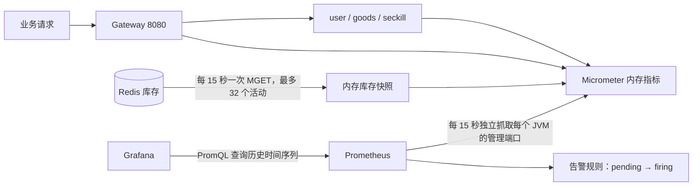

# M7：把秒杀系统变成可观测的系统

本章只实现监控与基础告警，不改前端，不改变库存扣减、事务和 MQ 消费语义。M6 验证台及其轮询暂时保留；日常观察改用 Grafana。完成 M7 也不意味着整个项目已经满足真实生产上线的全部条件。

## 1. 先理解三者的分工



- **Micrometer 是仪表**：在 Java 进程里累计次数、记录耗时、读取内存状态。它不负责长期保存历史。
- **Prometheus 是采集器和时序数据库**：主动拉取指标，保留 7 天历史（本地同时限制约 2GB），计算速率和告警。
- **Grafana 是展示层**：向 Prometheus 查询，不向业务接口循环发送库存/状态请求。

Prometheus 本身仍然是周期采样。这里改善的是采集口径、历史存储、聚合和告警，不是让所有变化都实时推送。1 秒秒杀洪峰可能被 15 秒窗口摊平；计数器仍能保留两次采样之间的累计事件，但采样前进程崩溃可能丢失最后一段内存指标。因此监控不能代替订单流水和对账。

## 2. 指标字典：看到一条线，要知道它到底代表什么

| 指标（Prometheus 名称） | 类型 / 口径 | 用途与边界 |
|---|---|---|
| `http_server_requests_seconds_count` | Timer 导出的累计请求数 | `rate` 后得到 QPS。看板仅选择 `/api/`，排除监控端点、静态页面和内部接口 |
| `http_server_requests_seconds_sum` | 累计请求耗时，单位秒 | 增量总耗时 / 增量次数 = 平均 RT |
| `http_server_requests_seconds_bucket` | 累计直方图桶 | 合并多个实例的桶后计算 P95/P99；这是估算值，精度受桶边界影响 |
| `seckill_order_admission_total{code}` | 秒杀 Controller 方法内的请求结果 | `0` 表示入口正常返回，通常是排队中，DB 降级时可能已同步完成；不代表全部异步订单落库成功 |
| `seckill_sentinel_blocked_total{resource,reason}` | Sentinel 真实拒绝事件 | 区分 `flow` 总 QPS、`hotspot` 热点参数、`degrade` 依赖熔断；不记录活动 ID |
| `seckill_gateway_blocked_total{route}` | 网关拒绝回调次数 | 当前唯一规则是 `seckill-service` 路由。未来增加路由规则时需扩展为固定路由白名单 |
| `cache_gets_total{cache,result}` | Caffeine 累计命中/未命中 | `result=hit/miss`，缓存名为 `hot-activity` / `hot-goods` |
| `cache_size{cache}` | 单 JVM 缓存条目数 | 不同实例各自一份，不是 Redis key 数量 |
| `seckill_stock_remaining{activity_id}` | Redis 剩余准入库存快照 | `-1`=key 不存在/未预热，`NaN`=未知；与异步落单后的 DB 库存不是同一个时间点 |
| `seckill_stock_monitored_activities` | 本实例配置的活动数量 | `0` 表示库存采集关闭，不等于 Redis 故障 |
| `seckill_stock_collection_up` | 最近一次库存采集是否成功 | 已配置活动且为 `0` 时需要关注 |
| `seckill_stock_collection_errors_total` | 采集失败累计次数 | Redis 失败、非法库存值、不完整返回都算失败，不影响下单线程 |
| `seckill_stock_collection_last_success_timestamp_seconds` | 最近成功采集的 Unix 秒时间戳 | `time() - 指标` 得到快照年龄；定时任务停滞时可以识别旧数据 |
| `up{application,instance}` | Prometheus 能否成功抓取目标 | 不能单凭它判断数据库、MQ 都健康 |

Spring Boot 自动提供 HTTP/JVM/连接池等指标；两个 Caffeine 是手工创建的，需显式 `CaffeineCacheMetrics.monitor` 绑定，并开启 `recordStats()`。Micrometer 版本跟随当前 Spring Boot 3.2.5 BOM，不独立升级以免依赖不匹配。

**为什么有 HTTP 指标还要业务指标？** 全局异常处理器可能返回 HTTP 200 + `{"code":429}`。只看 HTTP 5xx 会误认为完全健康。准入指标在异常转响应之前计数，并保持原异常不变；请求体校验未通过、未进入 Controller 方法的请求不计入准入指标，应看 HTTP 指标。

**为什么不把用户、订单、requestId 都放标签？** 每个标签组合是一条时间序列。10 万用户 × 多个接口 × 多个实例会迅速放大内存和存储成本。需要查具体订单时查业务流水/日志；监控标签只用固定枚举和少量活动白名单。

## 3. 启动方式

先构建（根目录）：

```powershell
.\mvnw.cmd -B -ntp verify
powershell -NoProfile -ExecutionPolicy Bypass -File scripts/monitoring/start.ps1
```

启动脚本只操作独立监控 Compose 项目，不重建现有 MySQL、Redis、RocketMQ、Nacos。首次生成 `.env.monitoring` 随机密码，该文件已加入 `.gitignore`。Grafana 账号 `admin`，密码从该本地文件读取。已有 Grafana 数据卷时修改环境变量不会重置现有管理员密码。

| 服务 | 业务端口 | monitoring profile 管理端口 |
|---|---|---|
| gateway-service | 8080 | 19080 |
| user-service | 8081 | 19081 |
| goods-service | 8082 | 19082 |
| seckill-service | 8083 | 19083 |

四个 Java 服务均需激活 `monitoring` profile。IDEA 每个启动配置的 Program arguments 添加：

```text
--spring.profiles.active=monitoring
```

若本来有其他 profile，请合并，例如 `dev,monitoring`，不要覆盖既有配置。profile 默认将管理端点绑定 `127.0.0.1`。Prometheus 在 Docker 中访问宿主机 `host.docker.internal:1908x`；若本机 Docker 网络不能访问 loopback，**仅在受信任的本地开发网络**为四个启动配置添加：

```text
--management.server.address=0.0.0.0
```

这会让管理端口监听宿主机所有接口。真实环境应绑定专用内网地址、由防火墙/NetworkPolicy 仅允许监控网段访问，或增加认证/TLS。不要把无鉴权管理端点发布到公网，也不要加一条 Gateway `/actuator/**` 转发规则。默认非 monitoring 配置仅暴露 health/info；metrics 和 prometheus 没有在业务端口开放。

秒杀服务额外设置需要观察的已有活动 ID（逗号分隔，不超过 32 个）：

```text
--seckill.monitoring.activity-ids=你的活动ID1,你的活动ID2
```

不填时库存采集关闭，其他指标正常。配置只控制监控，绝不会创建活动、预热或修改库存。ID 按 Java Long 解析；Grafana 标签按字符串保留完整 ID。

也可以用构建后的 jar（四个终端各运行一个）：

```powershell
java -jar seckill-user/target/seckill-user-0.0.1-SNAPSHOT.jar --spring.profiles.active=monitoring
java -jar seckill-goods/target/seckill-goods-0.0.1-SNAPSHOT.jar --spring.profiles.active=monitoring
java -jar seckill-seckill/target/seckill-seckill-0.0.1-SNAPSHOT.jar --spring.profiles.active=monitoring
java -jar seckill-gateway/target/seckill-gateway-0.0.1-SNAPSHOT.jar --spring.profiles.active=monitoring
```

同机第二秒杀实例必须同时修改业务端口和管理端口，例如 `--server.port=8084 --management.server.port=19084`，然后在 `monitoring/prometheus/targets/local.yml` 的秒杀 targets 中加入 `host.docker.internal:19084`。文件服务发现约 15 秒自动加载。每个 JVM 独立抓取，不能通过 Gateway 负载均衡随机抽到其中一个实例。

打开：

- [Prometheus Targets](http://localhost:9090/targets)：四个 target 应为 UP。
- [Grafana M7 看板](http://localhost:3000/d/seckill-m7)：数据源和看板自动导入，无需手动点配置。
- [Prometheus 告警](http://localhost:9090/alerts)：查看规则的 inactive / pending / firing。

## 4. 跟着做一次实验

1. 先看 Targets，全 UP 后再看业务曲线。刚启动且没有请求时，HTTP 速率和 P95 没数据是正常的，至少等待两次抓取。
2. 用已有的 `scripts/loadtest/load.mjs` 对已存在商品做 **detail 模式**读压测。先从并发 5、总数 100 起步，确认链路和看板，再逐步增加。不要一开始用下单模式消耗库存。
3. 观察 QPS、平均 RT、P95/P99。平均 RT 较低但 P99 高，说明少量请求较慢；可以关联 JVM、连接池、下游指标继续定位，而不能仅凭一张图认定根因。
4. 选择已标记热点的商品，观察 `hot-goods` 窗口命中率。没有命中曲线时先检查：是否确实为热点、是否有请求、是否跨过两次采样。冷商品不走这一层。
5. 如要验证限流，在单独的学习实验中降低已有 Sentinel 阈值并重启，观察拒绝曲线。网关拒绝发生在服务前；服务内拒绝则会在准入业务码 429 中看到。恢复阈值后再做容量测试。
6. 故障实验建议先停止一个你专门启动的测试实例：等待 1 分钟看到掉线告警 firing，恢复后告警自动消失。不要为了测试随意停共享数据库/Redis。

停止监控：

```powershell
docker compose --env-file .env.monitoring -f docker-compose.monitoring.yml stop
```

停止不会删除历史数据；不建议使用 `down -v`，它会删除监控数据卷。

## 5. 面试最容易追问的 PromQL

以下例子只看秒杀服务，避免把网关和下游的同一次请求重复累加。

```promql
# QPS：累计计数器先 rate 再 sum，rate 会处理单实例进程重启后的计数器归零。
sum(rate(http_server_requests_seconds_count{application="seckill-service",uri=~"/api/.*"}[5m]))

# 平均耗时：先各实例求增量，再按总次数加权；单位秒。
sum(rate(http_server_requests_seconds_sum{application="seckill-service",uri=~"/api/.*"}[5m]))
/
sum(rate(http_server_requests_seconds_count{application="seckill-service",uri=~"/api/.*"}[5m]))

# 集群 P95：合桶再求分位数，不能把实例 A 的 P95 和实例 B 的 P95 取平均。
histogram_quantile(0.95,
  sum by (le) (rate(http_server_requests_seconds_bucket{application="seckill-service",uri=~"/api/.*"}[5m]))
)

# 时间窗口内命中率：不是进程启动以来的累计命中率；没有请求时分母为零，保留无数据。
sum(rate(cache_gets_total{application="seckill-service",cache="hot-activity",result="hit"}[5m]))
/
sum(rate(cache_gets_total{application="seckill-service",cache="hot-activity"}[5m]))

# 多实例观察的是同一份 Redis 库存，去重展示，不可 sum。
max by (activity_id) (seckill_stock_remaining)
```

`max` 在多个实例采样略有时差时可能显示稍旧的较高库存，所以该值用于观察趋势，不能作为扣减判断或精确业务审计。必须结合采集状态和快照年龄。库存采集失败发布 NaN 并累加错误计数；抓取函数不访问 Redis，监控服务故障不会阻塞下单链路。

库存采集使用独立的单线程调度器，避免 Redis 超时占用原有 `@Scheduled` 线程而延误消息补偿。采用 fixedDelay，不会因一次采集变慢而堆积重叠任务；服务退出时关闭该线程。

## 6. 告警的含义与验证

告警包括：抓取失败持续 1 分钟、P95>500ms 且 QPS>1 持续 2 分钟、已配置库存但采集失败、快照长期不更新、入口系统错误持续>1次/秒。阈值是实验起点，正式应用应依据压测和 SLO 调整。限流不直接等于故障；正常洪峰下保护策略生效也会出现大量拒绝，因此本次展示限流指标但不做“只要拒绝就报警”。

`for` 要求连续满足条件，减少瞬间抖动引发的误报。当前只配置 Prometheus 规则，没有接 Alertmanager 或外部通知。完整生产通知链路还需要分组、抑制、静默、接收人和通知渠道。

```powershell
# 校验配置、PromQL 和规则行为（监控镜像需已拉取）
docker compose --env-file .env.monitoring -f docker-compose.monitoring.yml run --rm --no-deps --entrypoint promtool prometheus check config /etc/prometheus/prometheus.yml
docker compose --env-file .env.monitoring -f docker-compose.monitoring.yml run --rm --no-deps --entrypoint promtool prometheus test rules /etc/prometheus/tests/alerts.test.yml
# 只读检查业务管理端口、targets、看板及全部面板查询
powershell -NoProfile -ExecutionPolicy Bypass -File scripts/monitoring/verify.ps1
```

Java 测试覆盖真实 Sentinel 拒绝回调、业务异常不计为 Sentinel 拒绝、缓存命中/未命中、库存采集失败恢复与抓取不访问 Redis、标签数量限制、准入结果保持异常语义。告警测试验证持续时间和恢复，避免只有配置语法正确、实际永远不触发。

## 7. 建议按这个顺序读代码

1. 四个 `application-monitoring.yml`：先掌握依赖、管理端点和 HTTP 直方图。
2. `OrderAdmissionMetrics` / `SeckillController`：理解技术成功与业务成功为什么要分开统计。
3. `SentinelMetrics`：通过回调观察实际事件，保留 M6 的初始化时序。
4. 两个 `CacheMetricsConfig`：适配已有缓存，使用窗口速率计算命中率。
5. `StockMetrics`：白名单、批量采集、内存快照、故障时不撒谎。
6. `monitoring/prometheus/alerts.yml` 与 Grafana JSON：看 Java 指标怎样变成表达式和图表。

你可以这样向面试官概括：**“我给秒杀链路接了 Micrometer + Prometheus + Grafana。HTTP 指标关注吞吐和尾延迟，业务指标补充 HTTP 200 里隐藏的限流和失败；集群分位数通过直方图合桶计算。库存监控用有界活动白名单定时批量读取，并让抓取端只读内存，避免监控反过来拖慢交易。”**

别把“入口排队成功率”说成“异步订单最终成功率”。消费延迟、MQ 堆积、消息补偿积压、Redis/MySQL exporter、链路追踪和正式通知渠道仍是后续可扩展项。M8 的完整启动与学习入口见 [运行手册](runbook.md) 和 [面试讲解](interview.md)。

## 8. 本次本机验收记录（2026-09-14）

- `mvnw.cmd -B -ntp verify` 成功：100 个测试全部通过（user 6 / goods 35 / seckill 58 / gateway 1），现有 JaCoCo 门槛通过。
- Prometheus 配置检查成功，5 条告警规则的测试通过，包含掉线恢复、库存采集关闭不误报、P95 小样本抑制等场景。
- 四个管理端口 19080–19083 均正常，Docker 中四个 target 均 UP。本机实测 `127.0.0.1` 绑定可被 Docker Desktop 的 `host.docker.internal` 抓取，无需改成 `0.0.0.0`。
- Grafana 自动导入 16 个面板，数据源健康检查通过，全部 18 条看板查询与 5 条告警规则计算正常。
- 对已有商品 `2099130593394987010` 进行 100 次详情 GET、并发 5，全部返回业务码 0、无传输失败；Prometheus 查到对应 HTTP 请求与延迟数据。这是功能联调，不是容量基准。
- 库存观察使用已有活动 `2099130660617097217`、`2098789606474838018`；两者均已结束，采集状态为 1，库存为 -1（key 不存在），没有为造曲线创建或预热活动。
- 原业务端口不返回 Prometheus 指标。MVC 服务会将路径不存在包装成 HTTP 200 + 业务码 500；验收脚本同时检查响应内容，避免将其误判为指标泄露。该既有异常处理行为留待独立改进。

上述 M7 验收当时使用 `logs/m7-runtime/` 中的 jar 副本，日志在 `logs/m7-*.out.log`，进程清单在 `logs/m7-processes.json`；这是历史记录，不代表现在的启动方式。M8 已提供 [四服务启动器](../scripts/dev/start.ps1)，新进程使用 `logs/dev/`，已有 IDEA 服务会复用。修改源码后仍需重新构建并从原启动入口重启；详细规则见 [运行手册](runbook.md)。

参考官方文档：[Spring Boot 3.2 Actuator](https://docs.spring.io/spring-boot/docs/3.2.x/reference/html/actuator.html)、[Micrometer 缓存指标](https://docs.micrometer.io/micrometer/reference/reference/cache.html)、[Prometheus 埋点实践](https://prometheus.io/docs/practices/instrumentation/)、[Grafana 配置导入](https://grafana.com/docs/grafana/latest/administration/provisioning/)。
