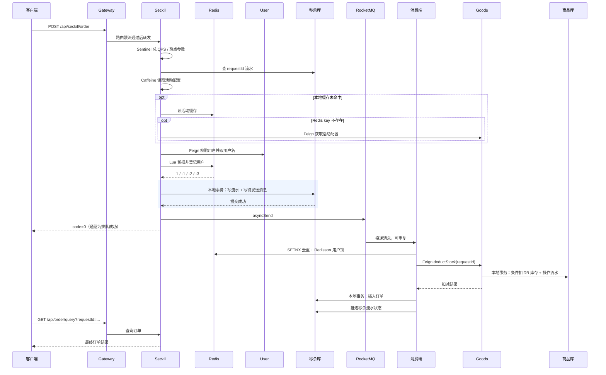
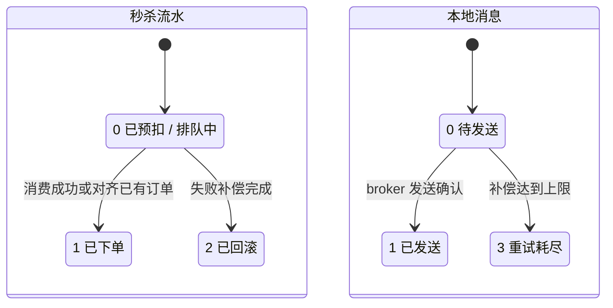

# 架构与下单链路：先看事务边界

## 1. 服务边界

user 管用户，goods 管商品、活动和 DB 库存，seckill 管请求流水、投递意图、订单，gateway 负责路由及入口保护。三库虽然位于同一 MySQL 实例，代码仍按微服务边界只访问自身 mapper。

Nacos 负责注册发现，Spring Cloud LoadBalancer 负责选择实例。不要说成“Nacos 执行所有负载均衡”。本地多个实例共用一台机器和中间件，不等同于多机容灾。

## 2. 正常请求时序

源码入口：[SeckillController](../seckill-seckill/src/main/java/com/seckill/seckill/controller/SeckillController.java)、[SeckillOrderServiceImpl](../seckill-seckill/src/main/java/com/seckill/seckill/service/impl/SeckillOrderServiceImpl.java)。

关键校正：即使活动/商品名称命中缓存，用户校验仍然有一次 Feign；不是“全热路径零 RPC”。入口依然同步写流水与消息，不是全部写操作都交给 MQ。订单插入和之后的流水推进，也不是同一事务。

## 3. 哪些操作原子，哪些不是

| 范围 | 已实现机制 | 不能据此推导的结论 |
|---|---|---|
| 单次 Redis Lua | 判断预热、判重、判断库存、扣减、登记串行执行 | 不包含 MySQL / MQ 的提交，也不是 Redis Cluster 跨 slot 事务 |
| 秒杀库流水 + 本地消息 | `RecordMessageWriter.write()` 独立 Bean 上的 `@Transactional` | Lua 预扣与此事务之间仍有宕机窗口 |
| 商品库库存 + 操作流水 | `StockOperationServiceImpl` 本地事务与唯一键 | catch 掉唯一键异常的路径不能自动推定整体回滚，见边界文档 |
| 订单插入 | `DbOrderWriter` 的本地事务、唯一键 | 无法自动撤销此前已提交的远端库存事务 |
| 跨服务失败 | 幂等操作、MQ 重试、同步补偿、定时对账 | 不是 XA，也不保证任意故障下瞬时强一致 |

事务方法拆成独立 Bean，是为了让调用经过 Spring 代理。业务异常是否触发回滚还取决于异常类型、是否被捕获、事务传播等，不能仅看有没有注解。参考 [Spring 声明式事务回滚](https://docs.spring.io/spring-framework/reference/data-access/transaction/declarative/rolling-back.html)。

## 4. 三种状态不能混在一起

“已发送”只表示 broker 发送状态，不是消费成功；“流水已下单”应与订单数据对应；订单 `status=0` 是待支付，不能与流水 `status=0` 的排队中混淆。支付链路尚未实现。

`MessageResendJob` 每 30 秒查到期的待发送消息，每批至多 200 条；失败线性退避，10 次后记为失败终态并输出日志。自动补偿有上限，不能写“消息永远不会丢”。需继续建设重试耗尽告警、死信处理与人工恢复工具。

## 5. 防重复处理的三层职责

1. SETNX 减少重复投递的常见开销，但拿到标记不代表处理成功。已有标记时还要看流水是否终态，排队中必须允许恢复处理。
2. Redisson 用户级锁减少同用户并发写入竞争；锁本身不能替代数据库约束。
3. `uk_user_activity` 与 requestId 唯一键限制订单重复。goods 的库存操作按 requestId 记录扣减/回滚，远端重试应遵循同一幂等语义。

幂等意味着“重复执行的业务效果应一致”，不是“第二次一定返回同一 HTTP 内容”。本项目重复抢购可返回业务码 3002。回滚后重入、不同请求共用用户等仍需按 [待验证窗口](known-limitations.md) 分别测试。

## 6. 缓存与库存的区别

goods 详情：热点商品先读 Caffeine 基础信息，未命中再走分布式布隆 → Redis → DB。逻辑过期时抢 SETNX 锁的线程同步重建，其他请求可返回旧值；不能把当前实现描述成“线程池异步重建”。物理 TTL 为 30–34 分钟。

seckill 活动配置：Caffeine → Redis → Feign goods 兜底。默认本地 TTL 1 秒。库存由 Lua 每次预扣，商品详情里的 DB 库存也独立查询。**展示库存缓存过期本身不必然导致超卖；是否超卖取决于交易扣减是否依赖不可信的旧值。** 当前设计把展示缓存与交易准入分开。

Redisson 布隆让多个实例共享位图，但“无假阴性”成立的前提是数据完整装载且新增数据及时登记。首次 `tryInit` 后尚未装载完成就退出等场景仍可能留下不完整过滤器，不能用数学性质替代初始化协议。

## 7. 限流、熔断与监控

- FlowRule / ParamFlowRule 默认是实例内阈值；多实例会扩大合计配额。热点限额不是为每个活动预留固定资源份额。
- Gateway 路由规则也是每个网关实例的限制；只在单网关部署下可以近似当作统一入口总闸。
- 当前依赖熔断按异常比例，不是慢调用比例；正常业务拒绝不记作依赖故障。
- HTTP RT 测到返回响应为止，MQ 排队及消费时延要另建指标；不能把入口 P95 当作最终落单 P95。
- Prometheus `up=0` 意味着抓取失败，可能是未启动、管理端口、网络或响应异常。告警历史与恢复后的 JVM 曲线会同时出现在一个时间窗口里。

## 8. 面试用“设计 → 实现 → 证据 → 边界”来讲

例如解释 Lua：先说读改写竞争会出错，再指向脚本中的原子资格判断与扣减，然后给出 200 线程抢 100 库存的脚本测试，最后说明它不覆盖跨库提交与 Redis 故障恢复。这样才能讲清楚每一层到底保证了什么。
